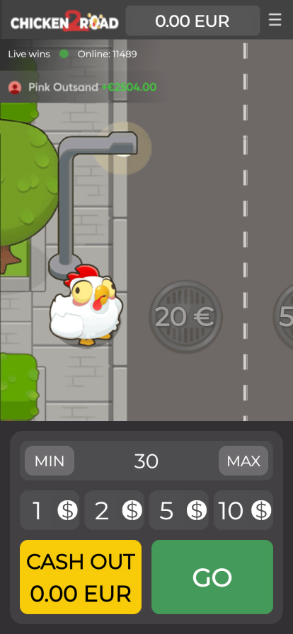
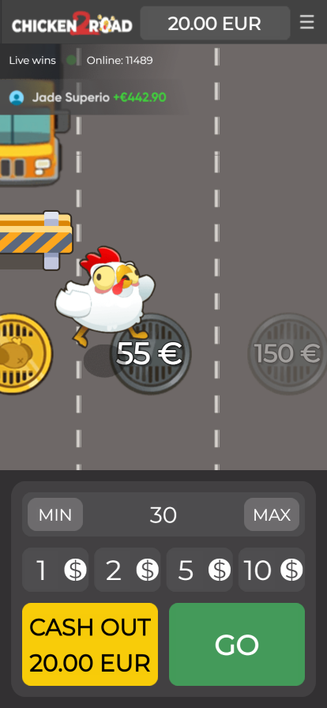

# CR_Jetpack

[Русская версия](README.ru.md)

## Overview

This project was developed for a client through third parties.

The original project files are subject to a non-disclosure agreement (NDA) and cannot be published.

## Screenshots

<table>
  <tr>
    <td></td>
    <td></td>
    <td></td>
  </tr>
  <tr>
    <td></td>
    <td></td>
    <td></td>
  </tr>
</table>

## Live demo

[View the live demo](https://mitfart.github.io/C.CR_Jetpack/)
